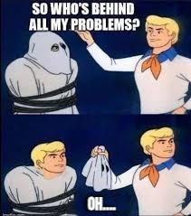

# Wrong Top-rated Products Sorting

Customers who noticed that the 3-star product had a higher rating than the 5-star product:

    

## Postmortem: Sorting Algorithm Issue on Online Shopping Website

If you attempted to sort the products by rating on the online shopping website between 02:00 and 02:40 P.M. MET, the sorting algorithm generated incorrect results. Consequently, the top-rated products were not displayed first, resulting in 30% of our customers being dissatisfied as they were unable to purchase the desired products.

### Timeline

- 02:10 P.M. MET - Numerous customer complaints were received regarding the sorting issue.
- 02:15 P.M. MET - The complaint service staff promptly escalated the problem to the development team.
- 02:16 P.M. MET - The developers immediately initiated troubleshooting by testing the issue on the website and engaging in discussions to identify potential causes.
- 02:21 P.M. MET - The development team split into two groups, with one focusing on investigating the rating system and the other examining the product database and the sorting algorithm.
- 02:32 P.M. MET - The second team identified the sorting algorithm as the root cause of the problem.
- 02:38 P.M. MET - The second team resolved the incident by modifying the sorting algorithm.
- 02:40 P.M. MET - The problem has been completely resolved and the modified algorithm has been uploaded to the website.

### Root Cause

    

Our developers used the quick sort algorithm to sort the products. In this algorithm, we store the pivot, which is the last item in the array, in a variable and compare each other item with it. Then, we put the items that have the best rating at the beginning of the array and place the pivot after them. We repeat this process for the two subarrays on the left and right of the pivot.

The issue occurred because of a mistake made by one of our developers. Instead of correctly swapping the last item of the array (the pivot) with the next item after the best-rated products, they mistakenly used the variable that stores the last item of the array during the swapping process. This error resulted in the array remaining unsorted and causing the incorrect product sorting on the website.

To address this problem, we corrected the swapping process by utilizing the array's last item instead of the pivot variable. This adjustment ensured that the products were sorted correctly on the website, resolving the issue.

### Corrective and Preventative Measures

To prevent similar issues in the future, we have implemented the following measures: implement automated testing for every method, function, or new feature using the `unittest` module or any other appropriate testing tool, and implement configuration management to ensure proper testing of test files before deployment

By following these measures, we aim to proactively identify and address any potential issues, ensuring a smooth and satisfactory experience for our customers.
